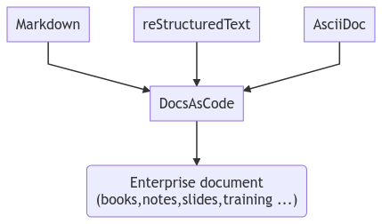

# TL;DR

A toolset to check and generate enterprise compliant documents, based on easy documentation languages.



## Installation (only docker)

```shell
docker pull docascod/docsascode:latest
```

## Documentation

* [Getting started with Markdown](docs/getting_started.md)

* TODO Getting started with RST

* TODO Custom theme