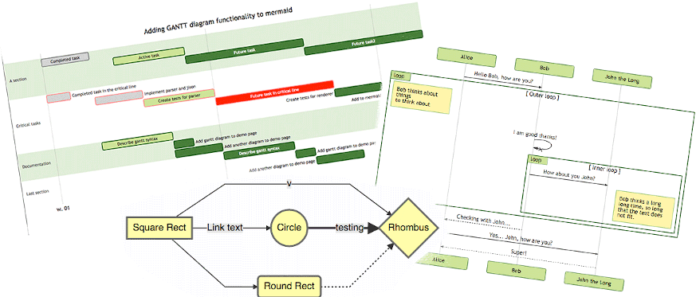
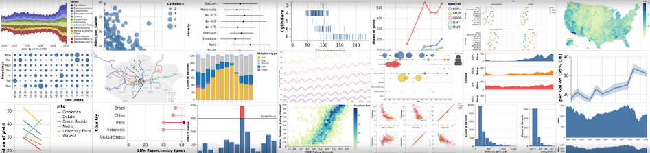

# Getting started with Markdown

## First document

1. Open your favorite [Mardown editor](https://marktext.app/) and start a new document.

2. Add a YAML header (yaml front matter) with :

   * `title` The title (first level heading #) of your document

   * `keywords` To indicate the desired output(s)

     > choose at less one of : output.document , output.slides, output.note

   * `lang` To indicate the language of the document (ie : en-EN, fr-FR)

   * `author` Author of this document. It should be an array

  > subtitle : should be added in the end of title (separated by `:`)

  Example:
  
  ```markdown
  ---
  title: 'My document: a subtitle'
  keywords: [keyword1, output.document, output.slides]
  lang: en-EN
  author: DocsAsCode
  ---

  your document body

  ```

3. Write your document

> Because `title` is always set in header, first level heading (`#`) must not be used

4. Build your document

```bash
docker run --rm -it -v <your directory>:/documents/ docascod/docsascode build <your document>.md
```

> \<your document\>.md and its dependencies (images, source) must be located in \<your directory\>

## Pimp your document

Markdown syntax is wonderful because of its simplicity. But when you write a professional document you need some advanced features !

### Page break

Markdown syntax does not allow to insert page break, but when you write slides you need it !

So, to set a page break you can use `<<<`

```asciidoc
content before page break

<<<

content after page break
```

### Special text block

Sometimes you want to highlight some text block (tip, warning ...). Mardown does not allow to do that easily !

You can use this syntax :

```asciidoc
NOTE: Just a note...

TIP: Pro tip...

IMPORTANT: Don't forget...

WARNING: Watch out for...

CAUTION: Ensure that...
```

### Images

In Markdown you can add image from url or path and ... that's all !! If you want to align or resize it, you must use html but it's not standard.

So, now you can :

* **horizontally align** your image on `left`, `right` or `center`:
  
  ```markdown
  
  ```

* **resize** your image :
  
  ```markdown
  
  ```

* **add a caption** (legend) after your image :
  
  ```markdown
  
  ```

All options can be combined (with alternative text):

```markdown

```

### Code bloc

You can insert block of code in Mardown and specify language to highlight.

Also now, you can :

* **Add callout** (comment on lines)
  
  ```markdown
  ​```json
  {
      "key1": "value",  <1>
      "key2": "value2"  <2>
  }
  ​```
  
  <1> comment on key1
  <2> comment on key2
  ```
  
* **Display lines number**, by adding `linenums` keyword just after language name

  ```markdown
  ​```json,linenums
  {
      "key1": "value",
      "key2": "value2"
  }
  ​```
  ```

* **Embed external source file**

  ```markdown
  ​```json
  include::myfile.json[]
  ​```
  ```

  You can also specify to display just a piece of code :

  ```markdown
  ​```json
  include::myfile.json[lines:5..10]
  ​```
  ```

### Diagrams

Some diagrams syntax can be interpreted during build and replaced by its representation !!

#### Mermaid

Mermaid allows designing of `Flow chart`, `Sequence diagrams`, `Class diagrams`, `State diagrams`, `Gantt`, `Pie` and `Git chart`. Full syntax on [https://mermaid-js.github.io](https://mermaid-js.github.io/mermaid/#/)

```markdown
A flow chart example :

​```mermaid
   graph LR
     A -->|Some Text| B
​```
```



#### Vega-lite

Vega-lite opens the data visualization world for you. You can load external data and display : bar chart, line chart, heat map, pie, map and more. Full syntax on [](https://vega.github.io/vega-lite/)

```markdown
A pie chart example :

​```vega-lite
{
  "$schema": "https://vega.github.io/schema/vega-lite/v4.json",
  "data": {
    "values": [
      {"category": 1, "value": 4},
      {"category": 2, "value": 6},
      {"category": 3, "value": 10}
    ]
  },
  "mark": "arc",
  "encoding": {
    "theta": {"field": "value", "type": "quantitative"},
    "color": {"field": "category", "type": "nominal"}
  },
  "view": {"stroke": null}
}
​```
```


#### PlantUML

PlantUML is originally specialized in UML diagrams, but it can also display Gantt, Mindmap... Full syntax : [](https://plantuml.com/)

```markdown
A sequence diagram example :

​```plantuml
@startuml
Alice -> Bob: Authentication Request
Bob --> Alice: Authentication Response

Alice -> Bob: Another authentication Request
Alice <-- Bob: another authentication Response
@enduml
​```
```

#### draw.io

A special case for draw.io. We can't interpret draw.io code. But if you choose to export your diagram as png with embedded code, you can :

* display it as normal image
* edit it in draw.io

#### extras

*caption* : YES you can have a caption after your diagram ! Add it just before diagram, must start with `.`

   ```markdown
   .mermaid caption
   ​```mermaid
      graph LR
        A -->|Some Text| B
   ​```
   ```
